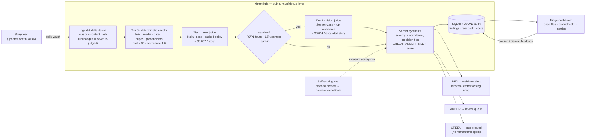

# Greenlight — a publish-confidence layer for high-volume story feeds

Every published story becomes an evidence-backed **GREEN / AMBER / RED** verdict,
automatically and repeatedly. Humans only look where attention is earned.


*Two-minute walkthrough: triage queue filling live → the brief's own `story_123`
case file with the swapped-CTA evidence → a reviewer dismissal recomputing the
verdict → the /metrics scorecard with live-run numbers.
[Higher-quality MP4](docs/demo.mp4).*

## The real issue

At high publishing volume, trust becomes an unobserved property: nobody can
answer *"is everything we just shipped correct, on-brand, and working?"* per
item. Errors get discovered by fans, sponsors, or clients — after publish.
Manual QA doesn't scale, sampling misses tail risk, and most publish-confidence
failures are boring and mechanical: dead links, broken media, placeholder text,
stale matchday posts. Those don't need AI — they need deterministic code that
runs on everything. AI earns its cost only on judgment calls (typos, tone,
coherence, what's actually in the pixels).

**The brief's own sample data demonstrates the class.** In `story_123`, page_2's
CTA says **"Buy tickets"** but links to **`/highlights`**, and page_1 says
**"Watch highlights"** but links to **`/match-report`**. Greenlight flags both,
offline, with JSON paths and a suggested fix:

```
P1 T1.cta_copy_mismatch  CTA 'Watch highlights' links to /match-report   pages[0].action.url
P1 T1.cta_copy_mismatch  CTA 'Buy tickets' links to /highlights          pages[1].action.url
```

(If the swap is intentional, a reviewer dismisses it once — the feedback loop
is how per-tenant thresholds tune over time.)

## What I built



A 60-second tour: a **feed poller** (cursor + content hash — unchanged stories
are never re-judged) feeds a **tiered cascade**: Tier 0 deterministic checks
(links, media, dates, dupes, placeholders — free, confidence 1.0, run on
everything) → Tier 1 text judge (Haiku-class, one structured-output call per
story) → Tier 2 vision judge (Sonnet-class, only on escalation / 15% sample /
tenant burn-in) → **deterministic verdict synthesis** (severity × confidence,
precision-first) → routing (RED → Slack-shaped webhook now; AMBER → review
queue; P2/P3 → stored, visible in case files and tenant health — a dedicated
daily-digest view is on the spec's cut list and not built) → a **triage
dashboard** with per-finding evidence and Confirm/Dismiss feedback → a
**self-scoring eval** that seeds known defects and measures
precision/recall/cost on every run.

## Quickstart

Prerequisites: Python 3.11+, **ffmpeg/ffprobe on PATH** (`apt-get install
ffmpeg` / `brew install ffmpeg` / `winget install Gyan.FFmpeg`) — the mock feed
synthesizes real videos. Without ffmpeg the pipeline's video checks degrade to
SKIPPED, but the demo world generator needs it.

```bash
git clone <repo> && cd greenlight
uv sync --group dev          # or: pip install -e ".[dev]" with Python 3.11+
make demo                    # Windows: uv run greenlight demo
# → dashboard on http://localhost:8000, mock feed on :8100 — no API key needed
```

Replay mode (the default) runs fully offline from `fixtures/ai_replay.jsonl`.
For live judging: `export ANTHROPIC_API_KEY=... && uv run greenlight ingest
--feed http://localhost:8100/feed.json --live` (records real responses into the
replay cache).

`make eval` · `make test` · `make watch` — or the same `uv run greenlight ...`
subcommands on Windows.

## Results (seeded-defect eval, LIVE run)

Real output of `greenlight eval --live` — 61 recorded API calls (Haiku 4.5
text judge on all 40 stories, Sonnet vision judge on 21 escalations), $0.30
total spend. Full tables and scoring rules in [eval/report.md](eval/report.md);
every judge response is committed in `fixtures/ai_replay.jsonl` (`source:
"live"`), so a reviewer reproduces these exact numbers offline, for free.

| metric | value |
| --- | --- |
| P0/P1 catch rate (seeded defects) | **96%** (22/23) — one miss, analysed below |
| Tier-0 (deterministic) checks | 20/20 classes at 100% recall / 100% precision |
| Injection attempt | caught by the live model (`T1.injection_attempt`), verdict unaffected |
| Flag rate on clean stories | 17% (4/24) — above the ≤10% target, analysed below |
| Median latency / story | 15.3 s live (10.9 s replay; ffmpeg + API dominated, single-threaded) |
| Measured cost | $0.0021/story Tier 1 · $0.0105/escalated story Tier 2 |

**What the live run exposed (kept honest, not re-rolled):**

- **`T1.coherence` missed its seed (0/1)** — the real judge didn't flag a title
  naming a club absent from the story's categories. Tuning next: the rubric line
  gets a worked example (the calibration example that made `spelling_grammar`
  reliable); re-run costs cents.
- **The clean-story flag rate is 17%, and the vision judge is the reason —
  arguably because it's right and our synthetic world is wrong.** The 4 flagged
  clean stories were hit by `T2.visual_brand`/`T2.visual_quality`: the tenant
  policy says matchday graphics must name both clubs, and our synthetic "clean"
  covers are abstract gradients that don't. The judge enforced the policy we
  gave it against covers our generator never made compliant. Fix is world-side
  (generate policy-compliant clean covers) plus a prompt note that stylised
  covers aren't photographs; the product-side backstop already exists — two
  reviewer dismissals surface the check as an auto-quiet candidate on /metrics.
- `T2.thumb_title_match` over-fires on abstract covers (20% precision, P2 so it
  never drives a verdict) — same root cause.

**Tuning history (the eval doing its job, both rounds):** the first replay
round caught `T0.dup_asset`/`T0.dup_story` at 12%/20% precision; measuring the
world's pHash distances (true dup at Hamming 0, template-sharing clean floor at
6–8) justified tightening `phash_near_hamming` 8 → 5, which took dup FPs to
zero without losing the catch. The live round then exposed the two judge issues
above. That loop — measure, explain, tune or report — is the point of shipping
the eval with the product.

**Honesty notes.**
- Eval-world judge rows above are **live-recorded** model outputs. The offline
  demo's world (a different seed) still replays hand-authored fixtures marked
  `"source": "hand_authored"` — plumbing demonstration, not model skill.
- Synthetic seeds ≠ production distribution, and synthetic covers are the
  proven weak spot (see above). Next validation step: shadow-run a real tenant
  feed and measure agreement with the analysts who do this triage today.
- Exact pHash distances are font/platform-dependent (synthetic assets render
  with local fonts); re-run `make eval` locally to re-derive.

## Cost

| Tier | Model | When it runs | List price basis | **Measured** cost/story |
|---|---|---|---|---|
| 0 | pure Python/ffmpeg | always | — | ~$0 |
| 1 | `claude-haiku-4-5` | every new/changed story | $1 / $5 per MTok | **$0.0021** (live, n=40) |
| 2 | `claude-sonnet-5` | escalation + 15% sample | $3 / $15 per MTok | **$0.0105**/escalated (live, n=21) |

Measured on the live eval: **$7.59 per 1k stories** on the defect-heavy eval
world (52% escalation by design); at a realistic 15% escalation on a clean feed
the same measured per-call costs project to **~$3.65 per 1k stories**. Batch
API halves AI cost for backfills. Model IDs and prices live in
`config/settings.yaml`, not in code; every finding carries its measured cost.
*(Caveat verified at build time:
prompt-cache reads don't apply at our prompt sizes — the minimum cacheable
prefix is 4096 tokens on Haiku 4.5 — so cost math assumes no cache discount.
Sonnet 5 intro pricing $2/$10 through 2026-08-31 would land below these
numbers.)*

## Decisions & assumptions

- **Advisory, never blocking** — Storyteller's CMS ships Draft→Published with no
  approval step; a monitor that fails can't break anyone's matchday.
  `gate_mode: hold_red` exists in config and raises `NotImplementedError` with
  a roadmap note — blocking is a flag away once precision is proven.
- **Deterministic before AI** — most failures are mechanical; code catches them
  for free at confidence 1.0.
- **Precision-first routing** — severity × confidence; low-confidence AI
  findings downgrade one level; UNVERIFIABLE (bot-blocked/infra) never alerts.
- **Policy is per-tenant YAML, not code** — locale, banned terms, domain
  allowlist, thresholds, kill switches, severity overrides.
- **Untrusted content, injection-defended** — story text is data; embedded
  instructions are themselves a defect (`T1.injection_attempt`); the output
  schema's check_id enum + server-side severity clamp mean injected text can't
  invent an "approved" state. Proven by seeded eval + tests.
- **Idempotent re-runs** — verdict cache keyed (content_hash, policy_version,
  prompt_version); re-running is free.
- **Costs metered per finding** — from the API usage block × configured prices.

Assumptions: the schema extends the brief's snippet without renaming anything;
the feed is poll-able JSON; assets are fetchable in live mode (offline mode
reports external links UNVERIFIABLE rather than guessing); en locale.

## How this shows up in the product over time

Now: sidecar + triage dashboard + RED webhook + per-tenant health. Next: a
"Confidence" column and finding chips inside the CMS story list; one-click
"apply suggested fix"; reviewer feedback auto-tuning per-tenant thresholds
(dismiss twice → auto-quiet the pattern). Later: pre-publish gate mode per
tenant; live-event priority lane; content-quality SLA for CSMs ("99% of
stories defect-free, median time-to-detect < 2 min").

## With engineering support, first

1. Real CMS/API integration + webhook ingestion instead of polling.
2. Reviewer feedback wired to per-tenant threshold tuning.
3. CMS UI embedding (confidence column + chips).
4. Live-event priority lane with latency SLOs.
5. Batch-API backfill over a tenant's whole catalog ("content debt" report).

## Deliberately not built yet

Auto-write-back fixes (trust first); blocking gates by default (product
promise); ASR/transcript checks on video audio (roadmap: speech profanity);
embedding-based style memory (needs data volume); i18n beyond en-GB/en-US;
reviewer workflow management (assignments/SLAs); fine-tuning (golden set far
too small — prompts + thresholds + feedback loop is the right first rung).

## Timebox


*~2.5 hours hands-on driving an AI build agent against a spec kit I prepared
beforehand (research and kit-writing time on top of that). The agent's outputs
were verified at milestone checkpoints; docs/AI_USAGE.md is the log.*

## How AI was used

Full log in [docs/AI_USAGE.md](docs/AI_USAGE.md). The short version:

- **I did the thinking; the agent did the typing.** Before any code existed, I
  wrote the product thesis (publish-confidence, not moderation), the full check
  catalog with thresholds and severities, both judge prompts with their schemas
  and injection defense, the seeded-defect eval design, and the dashboard spec
  — then drove Claude Code against that specification for ~2 hands-on hours.
- **I set the guardrails that make this repo trustworthy**: offline-first
  replay mode, never invent an eval number, mark every hand-authored fixture as
  such, verify model IDs/prices/SDK APIs against current docs instead of
  training memory, and self-check acceptance criteria at every milestone. The
  verification structure — not luck — is what caught the bugs and stale
  assumptions logged in AI_USAGE.md.
- **At runtime**, AI is a metered component, not the product: two versioned
  judge prompts behind enforced JSON schemas, costs computed per finding from
  the usage block, and a replay cache that makes every demo, test, and eval
  offline-deterministic.
